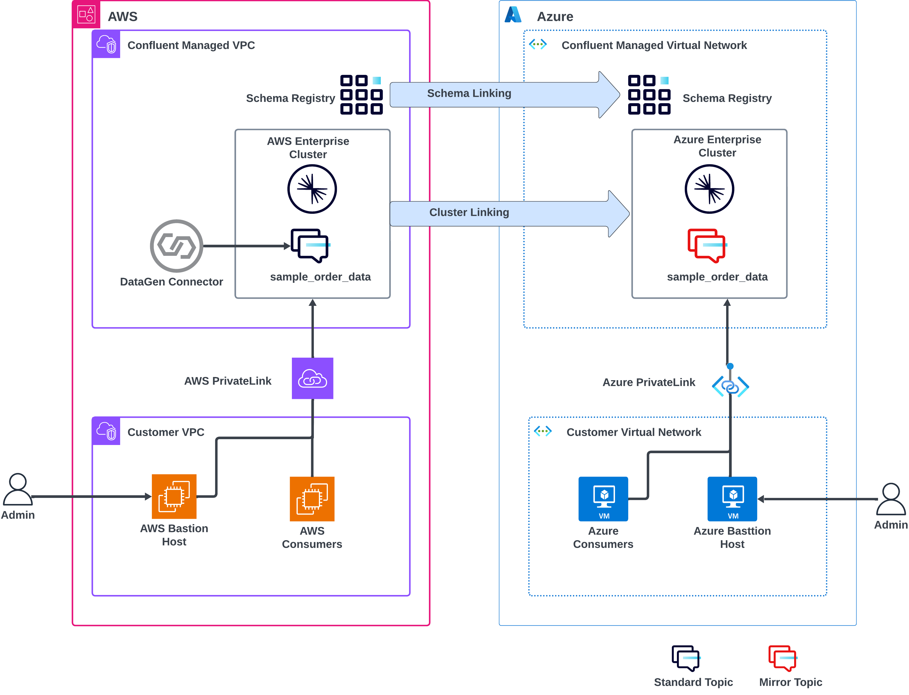

# Cross-Cloud Replication with Confluent Cluster Linking

This repository demonstrates how to set up cross-cloud replication between AWS and Azure using Confluent Cloud's Cluster Linking feature. It provides an automated infrastructure provisioning using Terraform and step-by-step instructions for configuring real-time data replication across cloud providers.

## 🏗️ Architecture Overview



Both the **source** and **destination** clusters are private. To access them, you need to log in to the corresponding **bastion hosts**.  

The Cluster Linking between the clusters will be a **destination-initiated link**, so it should be configured on the **destination cluster**.  

With this setup, data is replicated **without traversing the public internet**, keeping traffic within the cloud provider networks. You will access both clusters from your local machine via NGINX proxies deployed in each cloud. After deploying infrastructure, update your local hosts file so the Confluent endpoints resolve to the proxies, then run all commands locally (macOS or Windows).


## 🎯 Essential Setup (Complete First!)

Before proceeding with any other steps, you **must** complete these essential prerequisites:

### 1. 🔑 Create Required Accounts & API Keys

1. **Confluent Cloud Account**

   [](https://confluent.cloud/signup)

   [Log into your account](https://confluent.cloud/login)
   - Create [Cloud Resource Management API Keys with Organization Admin permissions](https://docs.confluent.io/cloud/current/security/authenticate/workload-identities/service-accounts/api-keys/overview.html#resource-scopes)

2. **Cloud Provider Access**
   - AWS account with appropriate permissions
   - Azure subscription with appropriate permissions

3. **Required Permissions**
   - Confluent Cloud: Organization Admin or Environment Admin
   - AWS: EC2, VPC, and related networking permissions
   - Azure: Virtual Machine, Virtual Network, and related permissions


## 📋 Install Required Software

- **AWS CLI**
- **Azure CLI** 
- **Confluent CLI**
- **Terraform**

<details>
<summary>Installing prerequisites on Mac</summary>

```bash
# Core tools
brew install git && brew tap hashicorp/tap && brew install hashicorp/tap/terraform && brew install --cask confluent-cli && brew install awscli && brew install azure-cli
```

</details>

<details>
<summary>Installing prerequisites on Windows</summary>

```powershell
# Core tools
winget install --id Git.Git -e && winget install --id Hashicorp.Terraform -e && winget install --id ConfluentInc.Confluent-CLI -e && winget install --id Amazon.AWSCLI -e && winget install --id Microsoft.AzureCLI -e
```

</details>

## 🚀 Getting Started


1.  Clone the repo onto your local development machine using `git clone https://github.com/confluentinc/demo-cross-cloud-replication.git`.
2. Change directory to demo repository and terraform directory.

   ```
   cd demo-cross-cloud-replication/terraform
   ```

3. In `terraform` directory,  create a `terraform.tfvars` file to store the Confluent Cloud API keys required by Terraform. Replace the placeholders below with your own keys.

   > Note: By default, the deployment uses the `us-east-2 ` region for AWS and `EAST US` for Azure. To deploy in different regions, simply set the `aws_region` and `azure_region` variables in your .tfvars file accordingly.

   <details>
   <summary>Click to expand for Mac</summary>

   ```bash
   cat > ./terraform.tfvars <<EOF
   confluent_cloud_api_key = "{Confluent Cloud API Key}"
   confluent_cloud_api_secret = "{Confluent Cloud API Key Secret}"
   EOF
   ```
   </details>

   <details>
   <summary>Click to expand for Windows CMD</summary>

   ```bash
   echo confluent_cloud_api_key = "{Confluent Cloud API Key}" > terraform.tfvars
   echo confluent_cloud_api_secret = "{Confluent Cloud API Key Secret}" >> terraform.tfvars
   ```
   </details>

4. Initialize Terraform

   ```bash
   terraform init
   ```

5. Deploy Infrastructure

   ```bash
   terraform apply --auto-approve
   ```

This will provision:
- Two Confluent Enterprise clusters (AWS and Azure)
- VPC/VNet and necessary networking components
- PrivateLink connections for secure communication
- NGINX proxy instances to front the private endpoints

## Post deployment steps

Because the clusters are private, first update your local hosts file so your browser and CLI reach Confluent through the proxies, then run everything from your local machine.
 
Update hosts locally (choose your OS). You can copy the combined command from Terraform outputs:
   - macOS/Linux: `update_hosts_macos_linux_all`
   - Windows: `update_hosts_windows_all`
 
   Or use Step 1 in `replication_commands.txt` which contains both OS variants.
   Note: `replication_commands.txt` is generated by Terraform in the `terraform/` directory and includes OS-specific commands for all steps.
   
   <details>
   <summary>macOS/Linux - example command</summary>
   
   ```bash
   # Replace the placeholders with values from: terraform output update_hosts_macos_linux_all
   echo '<AWS_PROXY_IP> <AWS_REST_HOST>' | sudo tee -a /etc/hosts && \
   echo '<AZURE_PROXY_IP> <AZURE_REST_HOST>' | sudo tee -a /etc/hosts
   ```
   </details>
   
   <details>
   <summary>Windows (CMD) - example command</summary>
   
   ```bat
   rem Replace the placeholders with values from: terraform output update_hosts_windows_all
   echo <AWS_PROXY_IP> <AWS_REST_HOST>   >> C:\Windows\System32\drivers\etc\hosts
   echo <AZURE_PROXY_IP> <AZURE_REST_HOST> >> C:\Windows\System32\drivers\etc\hosts
   ```
   </details>

## 📊 Set Up Sample Data Generation
 
Next, we need to create sample data in the source cluster. For this, we’ll use the DataGen Source connector. 
 
1. Open the [Connectors UI](https://confluent.cloud/go/connectors) from your local machine and select your AWS environment and cluster.

   

2. Click Add Connector and choose "DataGen Source". 
3. Click **Launch** the connector.
   

Data is now being genereated to `sample_order_data` on the AWS Source cluster. You can view the messages by navigating to the [Topics UI](https://confluent.cloud/go/topics).

   

## 🔗 Configure Cluster Linking

Configure Cluster Linking to replicate data from the source (AWS) cluster to the destination (Azure) cluster. This is a destination‑initiated link and should be configured against the destination cluster.
> Terraform generates OS‑specific commands in `replication_commands.txt` (macOS/Linux and Windows CMD). Use these and run the steps locally:
 
1. Login to Confluent CLI
   ```bash
   confluent login --save
   ```
2. Set Environment Context to the destination environment.
   ```bash
   confluent environment use <destination_environment_id>
   ```

3. Run the commands below to create `link-config.properties` and the cluster link.
> Note: You can copy the OS‑specific block from `replication_commands.txt` (generated by Terraform).
   
   <details>
   <summary>macOS/Linux</summary>
   
   ```bash
   cat > link-config.properties <<'EOF'
   auto.create.mirror.topics.enable=true
   consumer.offset.sync.enable=true
   auto.create.mirror.topics.filters={"topicFilters": [{"name": "*", "patternType": "LITERAL", "filterType": "INCLUDE"}]}
   EOF
   
   confluent kafka link create cross-cloud-link \
     --cluster <destination_cluster_id> \
     --source-cluster <source_cluster_id> \
     --source-bootstrap-server <source_cluster_bootstrap_server> \
     --source-api-key <source_api_key> \
     --source-api-secret <source_api_secret> \
     --config link-config.properties
   ```
   </details>
   
   <details>
   <summary>Windows (CMD)</summary>
   
   ```bat
   echo auto.create.mirror.topics.enable=true > link-config.properties
   echo consumer.offset.sync.enable=true >> link-config.properties
   echo auto.create.mirror.topics.filters={"topicFilters": [{"name": "*", "patternType": "LITERAL", "filterType": "INCLUDE"}]} >> link-config.properties
   
   confluent kafka link create cross-cloud-link ^
     --cluster <destination_cluster_id> ^
     --source-cluster <source_cluster_id> ^
     --source-bootstrap-server <source_cluster_bootstrap_server> ^
     --source-api-key <source_api_key> ^
     --source-api-secret <source_api_secret> ^
     --config link-config.properties
   ```
   </details>

> Note: Data may take a few minutes to appear in the destination cluster after creating the link.

Data and consumer offsets are now replicating from the source cluster on AWS to the destination cluster on Azure. Since both clusters are private, all replication traffic occurs within the cloud provider networks, without traversing the public internet.

However, if you navigate to the [Topics UI](https://confluent.cloud/go/topics) from the **Azure bastion host**, you’ll notice that the messages are **not human-readable**. This is because the data is **backed by a schema in the Schema Registry**.

To fix this and make the messages readable, we need to **synchronize the schemas** between the source and destination environments.


## 🔄 Schema Synchronization using Schema Linking

These steps run from your local computer. The repository includes pre-generated commands in `replication_commands.txt` for both macOS/Linux and Windows. 


1. Set Source Environment

   ```bash
   confluent environment use <source_environment_id>
   ```

2. Create Schema Exporter

   > **Note:** Terraform automatically created the `config.txt` file for you, which includes the destination Schema Registry details.

   ```bash
   confluent schema-registry exporter create cross-cloud-exporter \
   --subjects ":*:" \
   --config ./config.txt
   ```

This synchronizes all schemas from AWS Schema Registry to Azure Schema Registry.

## ✅ Verification

1. In the [Topics UI](https://confluent.cloud/go/topics), select the destination environemnt and cluster.
   
3. Verify mirrored topics appear in the Azure cluster. And click on `sample_order_data`.
   

Notice, that this is a mirrored topic managed by the cluster link we created earlier.

## 🧹 Cleanup

Do not forget to destroy all resources to avoid incuring charges.

First delete the data-gen connector since it was created outside terraform:

```bash
confluent connect cluster delete <DATAGEN_CONNECTOR_ID> --cluster <SOURCE_CLUSTER_ID> --environment <SOURCE_ENVIRONMENT_ID> --force
```
To destroy all the resources created run the command below from the `terraform` directory:

```bash
terraform destroy --auto-approve
```

**Ready to get started?** [Sign up for Confluent Cloud](https://confluent.cloud) and begin your cross-cloud replication journey today!
